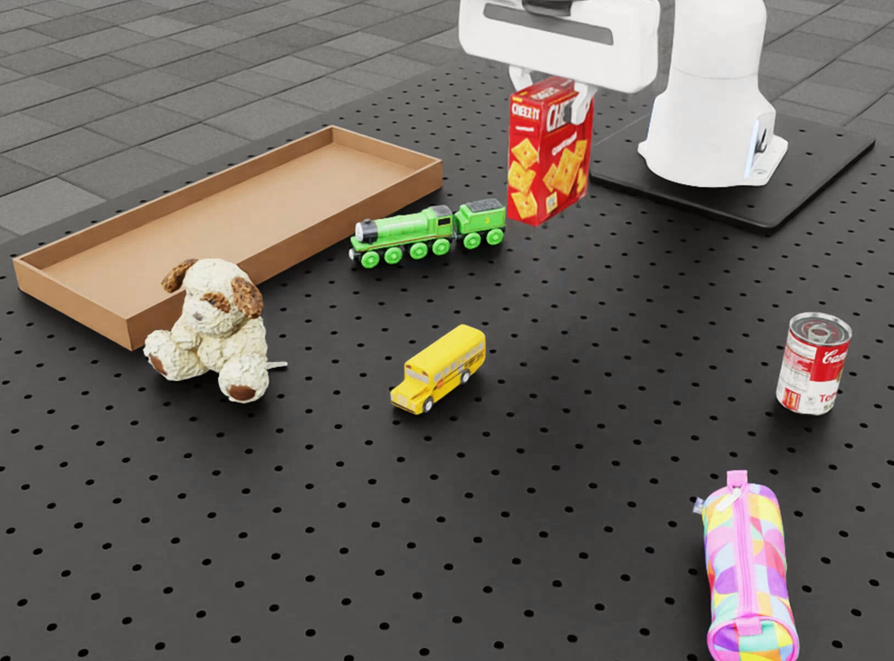
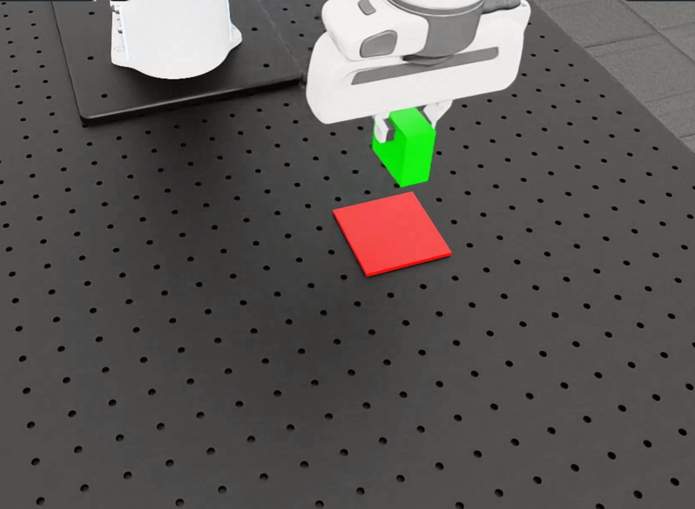
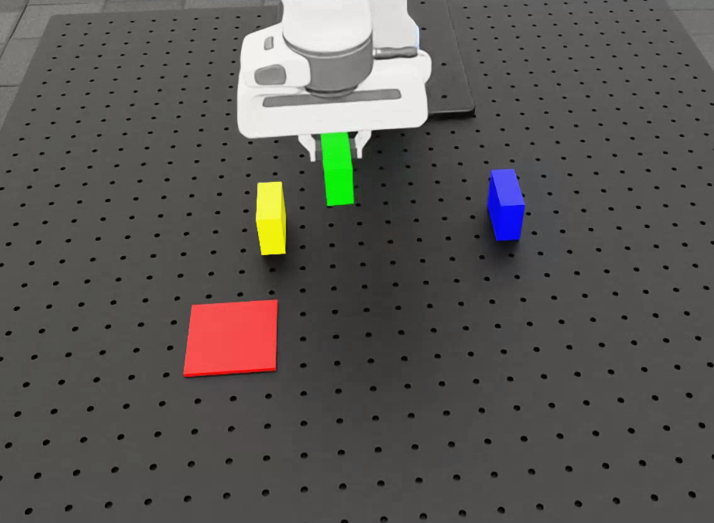
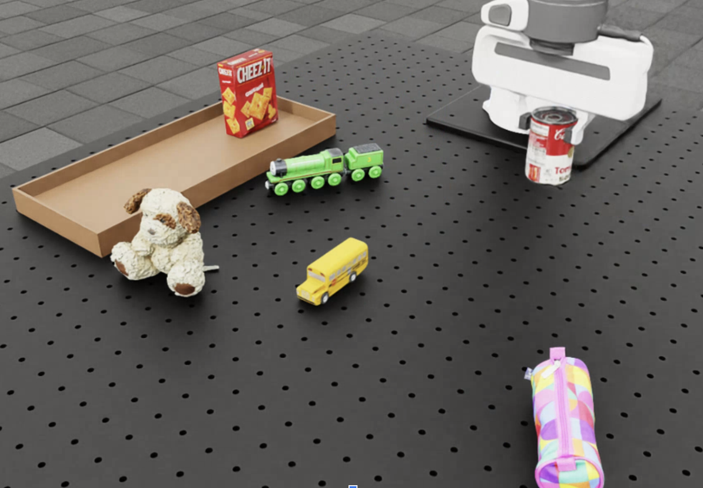
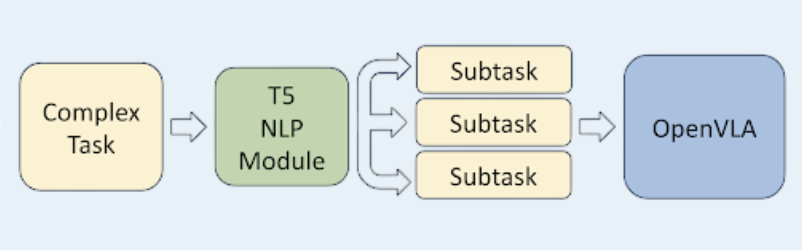

# Finetuning OpenVLA with Isaac Sim

## Project Overview

This project demonstrates how to fine-tune OpenVLA — a VLA robotic manipulation model — using simulation data generated by NVIDIA Isaac Sim.  
OpenVLA is a powerful vision-language-action model designed to enable robots to perform complex tasks by understanding visual inputs and language instructions. Fine-tuning OpenVLA with customized datasets collected from simulated environments allows adapting the model to specific tasks and scenarios reducing the complexity of collecting data in real world.  
Isaac Sim is an advanced simulation platform that enables creating realistic virtual environments for robots.

The overall workflow involves collecting data in simulation, building a robot learning dataset (RLDS) format, fine-tuning OpenVLA on that data, and then running real-time evaluation with OpenVLA controlling the simulated robot.

  

---

## 1. Clone the Main Repository

First, clone the main repository and navigate into the project folder:

    git clone git@github.com:RiccardoBianco/isaacsim_openvla.git
    cd isaacsim_openvla

---

## 2. Create Conda Environment for RLDS Dataset Builder

Ensure Conda is installed (Miniconda recommended):

    https://www.anaconda.com/docs/getting-started/miniconda/main

Create the environment for the RLDS dataset builder, depending on your OS:

    cd rlds_dataset_builder
    conda env create -f environment_ubuntu.yml
    cd ..

---

## 3. Create Conda Environment for OpenVLA

> **Important:** The OpenVLA conda environment must be installed on the device or cluster where you intend to run the OpenVLA server or perform fine-tuning.  
> It is **not** required on the device running Isaac Sim, which only communicates remotely with OpenVLA.

Proceed to create and configure the OpenVLA environment:

    cd ..  # move outside the isaacsim_openvla folder

    conda create -n openvla python=3.10 -y
    conda activate openvla

    # Install PyTorch and CUDA toolkit — check https://pytorch.org/get-started/locally/ for versions suited to your hardware
    conda install pytorch torchvision torchaudio pytorch-cuda=12.4 -c pytorch -c nvidia -y

    # Clone OpenVLA repository and install it
    git clone https://github.com/openvla/openvla.git
    cd openvla
    pip install -e .

    # Install Flash Attention 2, required for training
    pip install packaging ninja
    ninja --version; echo $?  # Confirm Ninja installed correctly (exit code 0 expected)
    pip install "flash-attn==2.5.5" --no-build-isolation

    # Optional: clean up by removing the OpenVLA repo folder
    cd ..
    rm -rf openvla
    cd isaacsim_openvla

---

## 4. Using Isaac Sim inside the Docker Container

Docker must be installed on your system:

    https://www.docker.com/get-started/

Start the Isaac Sim container and access it:

    xhost +local:root                 # Allow local GUI forwarding for Isaac Sim
    docker compose up -d isaac_sim   # Build and start the container in detached mode
    docker exec -it isaac-sim bash   # Open an interactive shell inside the container

    # Inside the container, run this to setup the environment variables and paths
    isaac_ws/setup_env.sh

---

## 5. Running Simulations Inside the Container

Several helper shell scripts are provided inside the container to facilitate simulation workflows:

### Data Collection

Collect simulation data by running:

    ./isaac_ws/data_collection.sh -x

Where `x` specifies the scenario:
- `-s` : single cube
- `-m` : multiple cubes
- `-r` : real objects

  
  
  

### Evaluation

Run the OpenVLA client to perform evaluation in simulation:

    ./isaac_ws/client.sh -x

`x` same options as above.

### Complex Task Evaluation
We introduced an NLP model to decompose complex tasks into sequential subtasks, enabling execution step-by-step—a capability that OpenVLA alone does not natively support. We chose the T5 model because it is lightweight, fast, and freely available. Although it may not offer the highest performance compared to other models, it works reliably for our scenarios.

For more advanced tasks broken down by a T5 module, run:

    ./isaac_ws/complex.sh

---

### Important

Scenario parameters (e.g., object configurations, camera settings) must be manually set at the start of the respective Python files:

- `data_collection_*.py`
- `evaluate_openvla_*.py`

Each data collection run saves a snapshot of parameters as a `.json` file with timestamp inside the `output/` folder.

---

## 6. Split Training and Validation Data

After data collection, split the dataset for training and validation:

    python3 split_train_val.py

You can configure split ratios by editing global variables at the top of this script.

---

## 7. Build RLDS Dataset Outside Docker

On your host machine (outside Docker):

    conda activate rlds_env
    cd rlds_dataset_builder/sim_data_custom_v0
    tfds build --overwrite
    conda deactivate

> Refer to the `rlds_dataset_builder` README if rebuilding dataset or troubleshooting.

---

## 8. Fine-tuning OpenVLA

After dataset creation, follow OpenVLA’s official LoRA fine-tuning instructions.

Edit the `openvla/start_finetuning.sh` script to specify:

- `data_root_dir` : location of your dataset repository
- `run_root_dir` : directory where the fine-tuned model will be saved

Run the script to start training.

---

## 9. Load and Deploy the Fine-tuned Model

After training completes:

1. Modify `openvla/vla-scripts/deploy.py` to update paths to the fine-tuned model (from `run_root_dir`).

2. Launch the OpenVLA inference server with:

       python3 openvla/vla-scripts/deploy.py

---

## 10. Running Evaluation Simulation with Isaac Sim

Back inside the Docker container, launch the client script to start evaluation:

    ./client.sh -x

Where `x` selects the scenario (`-s`, `-m`, or `-r`).

This script will:
- Run the simulation
- Capture images from the simulated robot’s camera
- Send images to the OpenVLA server for inference
- Receive action deltas for the robot’s end-effector
- Apply these actions in real time for continuous task execution

---

## Summary

- All OpenVLA development, dataset processing, and fine-tuning are done **outside** the Docker container.
- Isaac Sim simulation and related environment setup run **inside** the container to maintain consistency and avoid version conflicts.
- Parameter consistency between data collection and evaluation is essential for correct model performance.

---

## References

- [OpenVLA GitHub](https://github.com/openvla/openvla) — Vision-Language-Action robotic manipulation
- [NVIDIA Isaac Sim](https://developer.nvidia.com/isaac-sim) — Robotics simulation platform
- [RLDS Dataset Format](https://github.com/google-research/rlds) — Robot Learning Dataset Standard

---

If you encounter issues or need more information, consult the individual README files of each repository involved.

